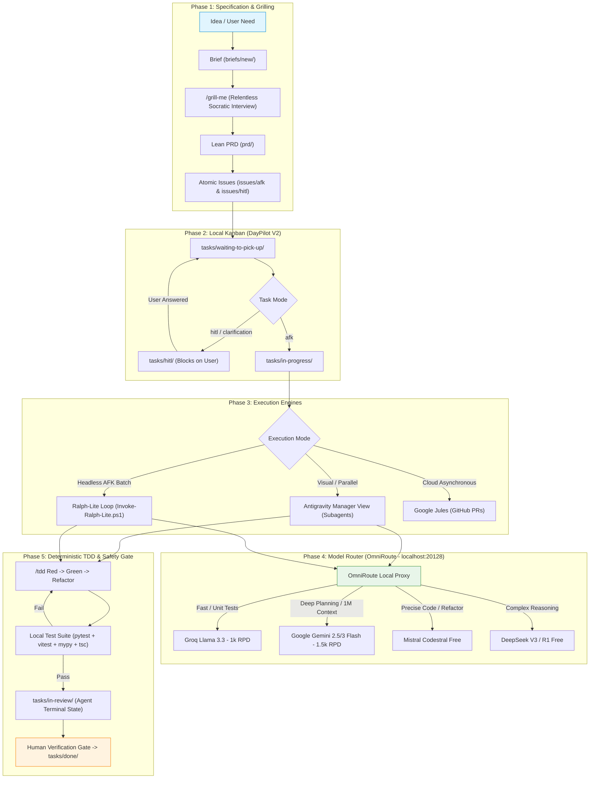

# 🦅 Zero-Budget Autonomous Engineering System (DayPilot + Ralph-Lite + Antigravity)

> **Objective:** Build an elite, production-grade software development pipeline with **$0 budget**, minimal token overhead, and maximum execution speed, combining the best parts of your established DayPilot/Ralph workflow with Google Antigravity, OmniRoute free-tier model cascading, and anti-bloat guardrails.

---

## 1. The Core Philosophy: High-Velocity, Token-Surgical Engineering

Traditional agentic setups (Copilot Opus, Claude 3.5 Sonnet / Claude Code, Cursor Pro) burn millions of tokens by dumping entire codebases into 100k+ context windows for every minor edit. On a **$0 budget**, this causes immediate rate limiting and failed builds.

Our **Zero-Budget Blueprint** is built on five core pillars:

```
┌───────────────────────────────────────────────────────────────────────────┐
│                          THE 5 ZERO-BUDGET PILLARS                        │
├───────────────────────────────────────────────────────────────────────────┤
│ 1. Free Model Cascading   │ OmniRoute routes to Gemini Flash (1.5k RPD)   │
│    (Zero API Cost)        │ → Groq Llama 3.3 → Mistral Codestral → DeepSeek│
├───────────────────────────┼───────────────────────────────────────────────┤
│ 2. Deterministic Gates    │ Let pytest, vitest, mypy, tsc do verification │
│    (Zero Token Burn)      │ — NEVER burn LLM tokens to check if code works│
├───────────────────────────┼───────────────────────────────────────────────┤
│ 3. Ponytail Minimalism    │ "The best code is the code you never wrote"   │
│    (-60% to -90% Tokens)  │ Enforce native standard library & 1-liners    │
├───────────────────────────┼───────────────────────────────────────────────┤
│ 4. Two-Tier Kanban Memory │ Tier 1: Local `working.md` + folder board     │
│    (Zero Context Bloat)   │ Tier 2: SQLite / MCP Knowledge Graph          │
├───────────────────────────┼───────────────────────────────────────────────┤
│ 5. Dual Execution Modes   │ Antigravity Manager View for visual/parallel  │
│    (Optimal Tool Fit)     │ + Ralph-Lite Headless CLI for batch AFK loops │
└───────────────────────────┴───────────────────────────────────────────────┘
```

---

## 2. Complete System Architecture



---

## 3. Model Tiering & Free API Routing Strategy

By configuring **OmniRoute** (`localhost:20128`), we eliminate vendor lock-in and pool multiple free developer quotas into a single unified OpenAI-compatible endpoint:

| Task Type | Primary Free Model | Fallback Model | Why Selected | Daily Quota |
|:---|:---|:---|:---|:---|
| **Architect / PRD Planning** | **Gemini 2.5/3 Flash** | DeepSeek V3 | 1M+ token context window, parses entire repos effortlessly | 1,500 RPD |
| **TDD Unit Tests & Scripts** | **Groq Llama 3.3 70B** | Gemini Flash | 500+ tokens/sec inference speed; near-instant red-green loops | 1,000 RPD |
| **Code Refactoring & Fixes** | **Mistral Codestral** | Gemini Flash | Specially fine-tuned for syntax precision in Python & TS | Free tier |
| **Complex Logic / Algorithms** | **DeepSeek V3 / R1** | Gemini Pro | High reasoning benchmarks on algorithmic tasks | Free tier |
| **Async Cloud PRs (Background)** | **Google Jules** | Antigravity Subagent | Completely handles end-to-end PR generation in Google VM | Free tier |

---

## 4. DayPilot V2: The Lean Folder Kanban

Your folder-based state machine in `daypilot-tasks-main` was already brilliant because **filesystem folders are the most robust, zero-token database**. We keep the state machine while making card schemas ultra-lightweight:

### Folder Stages
```
tasks/
├── waiting-to-pick-up/   # Ready for Ralph-Lite or Antigravity to grab
├── hitl/                 # Blocked on manual action or clarification
├── in-progress/          # Actively being coded on an isolated branch
├── ready-to-grill/       # Seed briefs awaiting /grill-me session
├── in-review/            # AGENT TERMINAL STATE (All tests passed + diff ready)
└── done/                 # HUMAN ONLY (Strict gate — agent never touches this)
```

### Streamlined Card Schema (`tasks/_TEMPLATE.md`)
```markdown
---
id: task-042
title: "Add JWT authentication middleware"
mode: afk               # afk | hitl | clarification
brief: brief-012        # linked brief (if applicable)
branch: brief/jwt-auth  # target git branch
parent_branch: main
created: 2026-08-18
stage: waiting-to-pick-up
---

## Objective
Implement token validation for incoming API requests in Python FastAPI.

## Acceptance Criteria
- [ ] Pytest passes in `backend/tests/test_auth.py`
- [ ] Returns 401 on expired or malformed token
- [ ] No new third-party packages if `PyJWT` / standard library can do it (Ponytail)

## Execution Log
- [2026-08-18 10:00] Picked up by Ralph-Lite
```

---

## 5. Modernized Ralph-Lite Loop (Replacing Paid Copilot CLI)

The original `Invoke-Ralph.ps1` relied on `copilot -p` which costs money. **Ralph-Lite** is a PowerShell/Bash runner that drives free tools (OmniRoute + Aider / OpenCode / Gemini CLI) against the local `issues/` queue:

### `Invoke-Ralph-Lite.ps1` (Zero-Cost Runner)

```powershell
<#
.SYNOPSIS
    Zero-Budget Autonomous Issue Runner (Ralph-Lite)
    Drives free LLM models via OmniRoute / Gemini API on local git branches.
#>
[CmdletBinding()]
param(
    [int]$Iterations = 5,
    [switch]$Once,
    [string]$RepoRoot = (Get-Location).Path,
    [string]$Model = "gemini-2.5-flash"
)

$ErrorActionPreference = "Stop"
Write-Host "`n🚀 === Ralph-Lite: Autonomous Zero-Budget TDD Loop ===" -ForegroundColor Cyan
Write-Host "Target Repo: $RepoRoot"
Write-Host "Model Route: $Model via OmniRoute (localhost:20128)"

# 1. Pre-flight checks
if (-not (Test-Path "$RepoRoot\issues")) {
    Write-Host "No issues/ directory found in repo. Exiting." -ForegroundColor Yellow
    exit 0
}

# 2. Find pending AFK issues
$afkIssues = Get-ChildItem "$RepoRoot\issues\*.md" | Where-Object {
    $content = Get-Content $_.FullName -Raw
    $content -match "mode:\s*afk" -and -not ($content -match "status:\s*done")
}

if ($afkIssues.Count -eq 0) {
    Write-Host "✅ No pending AFK issues found. Everything clean!" -ForegroundColor Green
    exit 0
}

Write-Host "Found $($afkIssues.Count) pending AFK issue(s)." -ForegroundColor Green

# 3. Execution Loop
$count = 0
foreach ($issue in $afkIssues) {
    $count++
    if ($count -gt $Iterations) { break }

    Write-Host "`n[Iteration $count/$Iterations] Processing: $($issue.Name)" -ForegroundColor Magenta
    
    # Run deterministic Red-Green-Refactor using free local agent
    # Calls Aider / OpenCode pointing to local OmniRoute
    aider --model "openai/$Model" `
          --openai-api-base "http://localhost:20128/v1" `
          --openai-api-key "omniroute-free" `
          --message-file $issue.FullName `
          --auto-test `
          --test-cmd "pytest backend/tests && npm test --prefix frontend" `
          --yes-always

    if ($Once) { break }
}
```

---

## 6. Antigravity Native Skills & Slash Commands

We have configured the following skills directly inside `~/.gemini/config/skills/` to provide your custom slash workflows:

| Slash Command / Skill | Purpose | Backed By |
|:---|:---|:---|
| **`/grill-me`** | Relentlessly questions your brief to uncover hidden assumptions and ambiguity before writing a line of code. | [`skills/grill-me/SKILL.md`](file:///D:/projects/handoff_repo-main/agent-skills/skills/grill-me/SKILL.md) |
| **`/tdd`** | Enforces Red -> Green -> Refactor cycle for both Python backend and React/Vite frontend. | [`skills/tdd/SKILL.md`](file:///D:/projects/handoff_repo-main/agent-skills/skills/tdd/SKILL.md) |
| **`/code-review`** | Runs Ponytail simplicity checks + Karpathy anti-hallucination scan + tree-sitter diff review. | [`skills/code-review/SKILL.md`](file:///C:/Users/Aryan%20Gupta/.gemini/config/skills/code-review/SKILL.md) |
| **`/subagent-orchestrator`** | Decomposes tasks into parallel Architect, Coder, Tester, Reviewer subagents in Manager View. | [`skills/subagent-orchestrator/SKILL.md`](file:///C:/Users/Aryan%20Gupta/.gemini/config/skills/subagent-orchestrator/SKILL.md) |
| **`/task-observer`** | Self-improving meta-skill that observes repeated corrections and generates new automated rules. | [`skills/task-observer/SKILL.md`](file:///C:/Users/Aryan%20Gupta/.gemini/config/skills/task-observer/SKILL.md) |
| **`/agent-alarm`** | Sets timer-based notifications via `/schedule` so you never babysit background tasks. | [`skills/agent-alarm/SKILL.md`](file:///C:/Users/Aryan%20Gupta/.gemini/config/skills/agent-alarm/SKILL.md) |

---

## 7. Anti-Token-Bloat Guardrails (Saving 80%+ Tokens)

### Guardrail 1: The Ponytail "Lazy Senior Dev" Ladder
Before generating code, the agent is forced through this decision gate:
1. **Does it need to exist?** (YAGNI — if no, delete requirement)
2. **Does Python stdlib / React core do it?** (Use `pathlib`, `itertools`, `fetch`, etc.)
3. **Is there an existing dependency in `pyproject.toml` or `package.json`?** (Use it)
4. **Can it be written in one line?** (Write the one-liner)
5. **Only then:** Write minimal code.

### Guardrail 2: Karpathy Grounding
- **Never guess missing specs**: Mark card as `clarification`, move to `tasks/hitl/`, and wait.
- **Surgical edits only**: Touch only lines required for the specific issue. Never reformat adjacent code.
- **Goal-driven verification**: Every prompt must end in an executable test command (`pytest ...` / `vitest ...`).

### Guardrail 3: Deterministic Test Gates (Zero LLM Tokens)
Never ask the LLM *"Does this code look correct?"*. Instead:
- Backend: Run `.venv/Scripts/pytest` & `.venv/Scripts/mypy .`
- Frontend: Run `npm test -- --run` & `npx tsc --noEmit`
- Only if the test fails do we feed the stack trace back to the LLM for a surgical fix.

---

## 8. Exact Step-by-Step Setup Guide ($0 Investment)

### Step 1: Start OmniRoute Local Proxy
OmniRoute is installed globally. Create your `~/.omniroute/config.yaml`:
```yaml
port: 20128
providers:
  - name: gemini
    api_key: ${GEMINI_API_KEY}
    priority: 1
    models: [gemini-2.5-flash, gemini-2.5-pro]
  - name: groq
    api_key: ${GROQ_API_KEY}
    priority: 2
    models: [llama-3.3-70b-versatile]
  - name: mistral
    api_key: ${MISTRAL_API_KEY}
    priority: 3
    models: [codestral-latest]
  - name: deepseek
    api_key: ${DEEPSEEK_API_KEY}
    priority: 4
    models: [deepseek-chat]

routing:
  strategy: priority-fallback
  retry_on_429: true
```
Start daemon:
```powershell
omniroute start
```

### Step 2: Add Free API Keys to Environment
Add to your Windows User Environment Variables:
- `GEMINI_API_KEY` from [aistudio.google.com](https://aistudio.google.com)
- `GROQ_API_KEY` from [console.groq.com](https://console.groq.com)
- `MISTRAL_API_KEY` from [console.mistral.ai](https://console.mistral.ai)
- `GITHUB_PERSONAL_ACCESS_TOKEN` in [`~/.gemini/config/mcp_config.json`](file:///C:/Users/Aryan%20Gupta/.gemini/config/mcp_config.json)

### Step 3: Link Central Skills into Antigravity
We can symlink or copy the `agent-skills` folder directly so Antigravity loads both your work skills and our new meta-skills:
```powershell
# Copy skills from handoff repo to Antigravity global skills
Copy-Item -Recurse "D:\projects\handoff_repo-main\agent-skills\skills\*" "C:\Users\Aryan Gupta\.gemini\config\skills\" -Force
```

### Step 4: Daily Operating Routine
1. **Morning**: Open Antigravity IDE. Review `tasks/waiting-to-pick-up/` and `working.md`.
2. **Planning & UI**: If building new UI, open **Google Stitch** (`stitch.withgoogle.com`) for free instant designs.
3. **Specification**: Write seed brief in `briefs/` -> Run `/grill-me` -> Generate atomic issues.
4. **Execution**:
   - For fast parallel work: Spawn subagents in Antigravity **Manager View**.
   - For long AFK sessions: Run `.\scripts\Invoke-Ralph-Lite.ps1 -Iterations 5`.
   - For async background tasks: Assign issue to **Google Jules** on GitHub.
5. **Review**: Check cards in `tasks/in-review/` -> Run `/code-review` -> Move approved cards to `tasks/done/`.

---

## 9. Comparison: Old Setup vs. New Zero-Budget Setup

| Dimension | Old Setup (Handoff Repo) | New Zero-Budget System (Antigravity V2) |
|:---|:---|:---|
| **Monthly Cost** | Paid Copilot / Opus API ($50–$150/mo) | **$0.00 / month guaranteed** |
| **Model Routing** | Single model (Copilot Opus) | **OmniRoute 4-tier cascading (Gemini -> Groq -> Mistral -> DeepSeek)** |
| **Token Efficiency** | Full-context dumps | **Ponytail + Headroom (-80% token overhead)** |
| **IDE & Orchestration** | Standard Copilot CLI chat | **Antigravity Parallel Manager View + Chrome DevTools** |
| **Specification Gate** | Manual grilling | **Automated `/grill-me` + Google Stitch Design-to-Code** |
| **AFK Loop** | `Invoke-Ralph.ps1` (Copilot CLI) | **`Invoke-Ralph-Lite.ps1` (OmniRoute + Local Aider / OpenCode)** |
| **Async Tasks** | None (blocked local machine) | **Google Jules (Cloud background PR creation)** |
| **Memory** | Stateless / Manual | **2-Tier: `working.md` + Persistent Memory MCP Knowledge Graph** |
