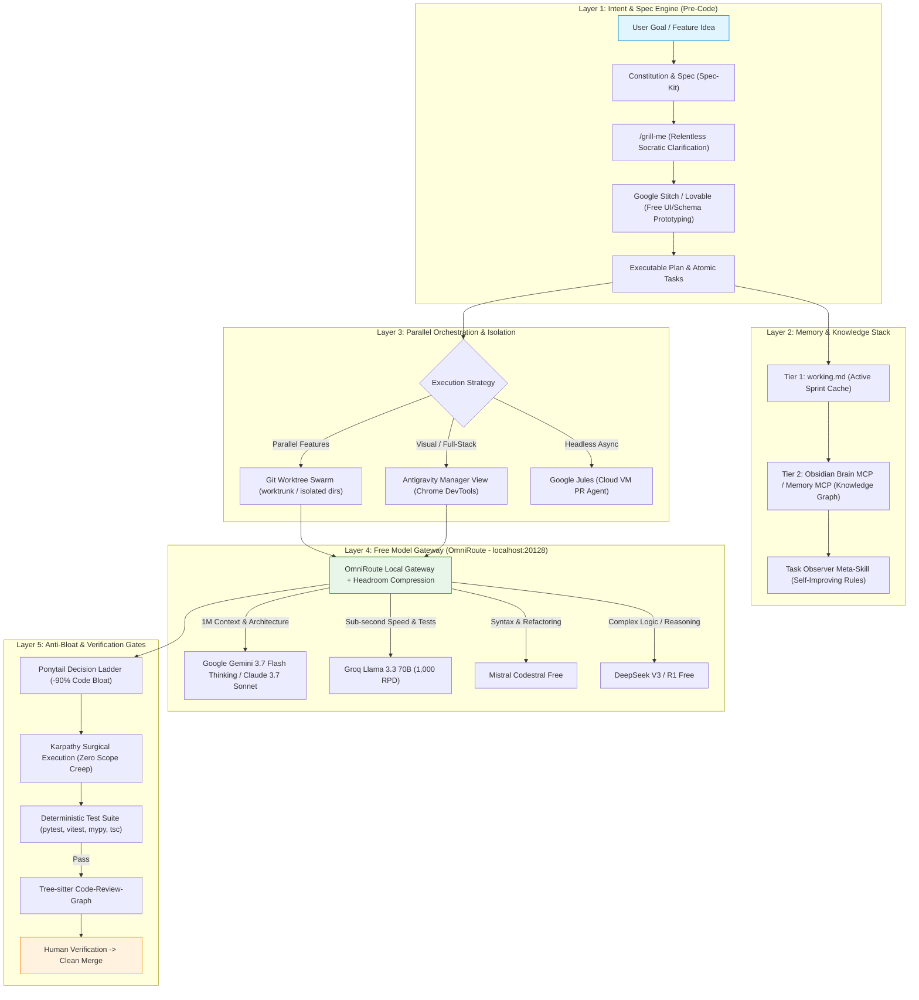

# 🌌 The State-of-the-Art Zero-Budget Agentic Engineering Blueprint (2025–2026)

> **Core Philosophy:** True agentic mastery on a **$0 budget** is not about burning massive token context in single-prompt chat windows. It is about **Context Engineering**, **Spec-Driven Development (SDD)**, **Git Worktree Isolation**, **Intelligent Free-Model Cascading**, and **Strict Anti-Bloat Guardrails**.

---

## 1. The 2025–2026 Paradigm Shift: Beyond "Vibe Coding"

In 2024, developer AI relied on "vibe coding" (ad-hoc chat prompting) and monolithic context dumps that quickly exhausted free API quotas and caused severe context rot. 

The industry leaders in 2025–2026 have shifted to **Agentic Software Engineering**, built on four modern pillars:

```
┌────────────────────────────────────────────────────────────────────────────────────────┐
│                              THE 4 PILLARS OF MODERN AGENTIC CODING                    │
├────────────────────────────────────────────────────────────────────────────────────────┤
│ 1. Spec-Driven Development (SDD)  │ Specs as executable contracts (Constitution ->     │
│    (Zero Hallucination / Drift)   │ Spec -> Plan -> Tasks -> Code). Never code blind.  │
├───────────────────────────────────┼────────────────────────────────────────────────────┤
│ 2. Git Worktree Swarms            │ Physical directory isolation for parallel agents.   │
│    (Zero Merge Chaos)             │ No dirty-tree conflicts, no branch fighting.       │
├───────────────────────────────────┼────────────────────────────────────────────────────┤
│ 3. Context Engineering & CCR      │ Cache-Compress-Retrieve (Headroom, Ponytail).      │
│    (-80% to -95% Token Waste)     │ Keep active context <400 tokens; compress logs.    │
├───────────────────────────────────┼────────────────────────────────────────────────────┤
│ 4. Free Model Cascading           │ Local OmniRoute pooling of high-volume free tiers  │
│    (100% Free / Zero API Bills)   │ (Gemini 1.5k RPD + Groq 1k RPD + Codestral + R1).  │
└───────────────────────────────────┴────────────────────────────────────────────────────┘
```

---

## 2. Master System Architecture



---

## 3. The Comprehensive Free Toolchain Matrix

Every single tool in this stack is **100% free** or operates on a generous permanent free tier:

| Category | Tool | How It Operates | Best For | Cost |
|:---|:---|:---|:---|:---|
| **Model Gateway** | **OmniRoute** | Local proxy (`localhost:20128`) pooling all free API keys with auto-fallback | Unified OpenAI-compatible endpoint with token compression | $0 (Open Source) |
| **Context Optimizer** | **Headroom AI** | Intercepts tool outputs/logs with Cache-Compress-Retrieve (CCR) | Compresses agent context by 60–95% | $0 (Open Source) |
| **Model: Primary** | **Google Gemini 3.7 Flash (Thinking)** | 1M+ context window via Google AI Studio API | Deep repo exploration, planning, high-context tasks (1,500 RPD) | $0 (Permanent Free) |
| **Model: Fast TDD** | **Groq Llama 3.3** | Ultra-low-latency LPU inference (500+ tokens/sec) | Rapid unit-test generation and iterative red-green loops | $0 (Permanent Free) |
| **Model: Precision** | **Mistral Codestral** | Dedicated code model via La Plateforme API | Python, TypeScript, and Rust refactoring & type fixes | $0 (Free Tier) |
| **Model: Reasoning** | **DeepSeek V3 / R1** | High-performance open-weight reasoning | Complex algorithmic design & edge-case discovery | $0 (Free Tier) |
| **UI Design-to-Code** | **Google Stitch** | AI-native design canvas generating React, Vue, Flutter, SwiftUI | Visual UI prototyping before backend integration | $0 (Free Web) |
| **Rapid MVP Builder** | **Lovable MCP** | Full-stack app generator connected directly via MCP server | Scaffolding databases (Supabase), auth, and components | $0 (5 daily credits) |
| **Async PR Agent** | **Google Jules** | Cloud VM agent that clones repos, writes code, and opens PRs | Unattended background maintenance & chore issues | $0 (Free Tier) |
| **GPU Compute Lab** | **Kaggle / Colab** | 30 hours/week NVIDIA T4/P100 GPU compute | Running local Ollama models (Qwen 2.5 Coder 32B, DeepSeek R1 32B) | $0 (Free Tier) |
| **Security Agent** | **Strix AI** | Autonomous penetration-testing agent with validated PoCs | Pre-deployment vulnerability auditing and security scans | $0 (Open Source) |
| **Internet Scraper** | **Agent-Reach** | CLI capability layer scraping GitHub, Reddit, YouTube, X | Real-time library research without paid API keys | $0 (MIT License) |
| **Worktree Manager** | **Worktrunk / wt** | Fast CLI for spinning up isolated git worktrees | Parallel multi-agent file isolation | $0 (Open Source) |
| **Knowledge Vault** | **Obsidian Brain MCP** | SQLite-vector indexed local markdown vault | Deep long-term memory, architectural decision records (ADRs) | $0 (Local/Free) |
| **Diff Reviewer** | **Code-Review-Graph** | Tree-sitter + SQLite AST indexer | Surgical diff reviews with ~97% token reduction | $0 (Open Source) |

---

## 4. The 6-Phase "Autonomous Flow" Lifecycle

### Phase 1: Constitution & Intent (Spec-Driven Development)
1. **Define the Project Constitution (`CONSTITUTION.md`)**:
   - Establish non-negotiable tech stack constraints, linting rules, and trust boundaries.
2. **Draft the Feature Spec (`spec.md`)**:
   - Write user stories and acceptance criteria.
   - For UI tasks: Generate initial high-fidelity mockups in **Google Stitch** (`stitch.withgoogle.com`) or **Lovable** and export clean component code.

### Phase 2: Socratic Clarification (`/grill-me`)
- Run the `/grill-me` skill against the draft specification.
- The agent actively stress-tests edge cases, surfaces implicit assumptions, and forces decisions before code is touched.
- **Rule:** If ambiguity exists, do *not* guess. Resolve the branch in the spec.

### Phase 3: Worktree Provisioning & Multi-Agent Fan-Out
- Never run parallel agents in the same working directory.
- Create an isolated Git worktree:
  ```bash
  git worktree add ../feature-auth -b feat/jwt-auth
  cd ../feature-auth
  ```
- Launch agents in **Antigravity Manager View** or via terminal agents pointing to OmniRoute (`localhost:20128`).

### Phase 4: Surgical Coding with Ponytail & Karpathy Guardrails
Agents execute tasks governed by two foundational skill sets:

#### 1. Ponytail Decision Ladder
- **Level 1:** Does this code need to exist? (YAGNI)
- **Level 2:** Does the standard library do it? (e.g., `pathlib`, `itertools`, `crypto`)
- **Level 3:** Is there a native browser/platform feature? (e.g., `<input type="date">`, `fetch`)
- **Level 4:** Is there an existing dependency?
- **Level 5:** Can it be written in one line?
- **Level 6:** Only then write minimal code.

#### 2. Karpathy Grounding Rules
- **Think First:** State assumptions explicitly. Surface trade-offs before typing.
- **Simplicity First:** Write the minimum code required. No speculative abstractions.
- **Surgical Edits:** Touch *only* what you must. Never reformat adjacent code or delete unrelated comments.
- **Goal-Driven Execution:** Every task must map to an automated test command.

### Phase 5: Deterministic Verification (Zero LLM Token Burn)
Never ask an LLM *"Does this look correct?"*. Rely on deterministic local tooling:
- **Backend (Python):** `pytest backend/tests && mypy backend`
- **Frontend (TS/React):** `npm test -- --run && npx tsc --noEmit`
- **Security Check:** Run **Strix AI** for vulnerability validation.
- **Diff Review:** Run **Code-Review-Graph** (Tree-sitter) to verify AST modifications without burning LLM context.

### Phase 6: Memory Consolidation & Task Observer
- **Short-Term Context:** Update `working.md` with session achievements and blockers.
- **Long-Term Knowledge:** The **Memory MCP** and **Obsidian Brain** index architectural decisions for cross-session recall.
- **Self-Improvement:** The **Task Observer** meta-skill observes repeated user corrections and auto-generates improved rules in `~/.gemini/config/rules/`.

---

## 5. Model Routing & Token Optimization Architecture

### OmniRoute Multi-Provider Config (`~/.omniroute/config.yaml`)

```yaml
port: 20128
providers:
  - name: gemini
    api_key: ${GEMINI_API_KEY}
    priority: 1
    models:
      - gemini-2.5-flash
      - gemini-2.5-pro
  - name: groq
    api_key: ${GROQ_API_KEY}
    priority: 2
    models:
      - llama-3.3-70b-versatile
      - mixtral-8x7b-32768
  - name: mistral
    api_key: ${MISTRAL_API_KEY}
    priority: 3
    models:
      - codestral-latest
  - name: deepseek
    api_key: ${DEEPSEEK_API_KEY}
    priority: 4
    models:
      - deepseek-chat
      - deepseek-reasoner

routing:
  strategy: priority-fallback
  retry_on_429: true
  max_retries: 3

compression:
  enabled: true
  engine: rtk
```

---

## 6. Comparison: Traditional Paid Setup vs. Modern 2026 Zero-Budget Stack

| Metric / Dimension | Traditional Paid Setup (Cursor Pro / Claude Code) | Modern 2026 Zero-Budget Blueprint |
|:---|:---|:---|
| **Monthly Cost** | $40–$200 / month | **$0.00 / month (Guaranteed)** |
| **Context Strategy** | Giant monolithic prompt dumps (100k+ tokens) | **Context Engineering: Headroom CCR + Ponytail (-80% tokens)** |
| **Model Redundancy** | Single-vendor lock-in (outages/rate-limits block work) | **OmniRoute 4-tier automatic cascading across providers** |
| **Parallel Execution** | Stash-switching or single-branch bottlenecks | **Git Worktree Swarms (fully isolated physical directories)** |
| **UI & MVP Creation** | Manual coding from scratch | **Google Stitch (Design-to-Code) + Lovable MCP** |
| **Background Tasks** | Blocks local IDE session | **Google Jules Cloud VM (asynchronous PR generation)** |
| **Memory System** | Ephemeral chat history (lost on restart) | **Two-Tier: `working.md` + Persistent Knowledge Graph (Memory MCP)** |
| **Code Review** | Manual human review or paid bots | **Tree-sitter AST Graph + Ponytail Simplicity Filter** |
| **Security Validation** | Manual audits | **Strix AI autonomous open-source pen-testing** |

---

## 7. Actionable Verification & Quick-Start Checklist

1. **Verify OmniRoute**:
   ```bash
   omniroute start
   curl http://localhost:20128/v1/models
   ```
2. **Verify MCP Stack in Antigravity**:
   - Open Antigravity IDE and confirm `sequential-thinking`, `memory`, `filesystem`, `playwright`, `notion`, `lovable`, and `github` are active.
3. **Run a Spec-Driven Feature Cycle**:
   - Write a brief in `briefs/` -> run `/grill-me`.
   - Create worktree: `git worktree add ../feat-demo -b feat/demo`.
   - Run TDD feature implementation with Ponytail guardrails.
   - Run local tests (`pytest` / `npm test`).
   - Merge back into `main` and clean up worktree: `git worktree remove ../feat-demo`.
