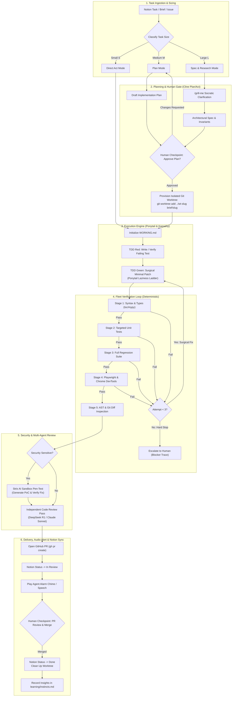

# 🌌 Antigravity End-to-End Autonomous Engineering Workflow (2026)

> **Core Law:** One Task → One Agent Session → One PR. Keep work bounded, surgical, deterministic, and verifiable under a $0 model budget.

---

## 1. Complete Workflow Lifecycle



---

## 2. Stage-by-Stage Operational Standard

### Stage 1: Ingestion & Sizing

Every incoming requirement from Notion, chat, or GitHub is triaged into one of three sizing categories:

| Size           | Scope & Characteristics                                                                      | Execution Path                                                                                                                                                          | Target Model Tier                                |
| :------------- | :------------------------------------------------------------------------------------------- | :---------------------------------------------------------------------------------------------------------------------------------------------------------------------- | :----------------------------------------------- |
| **Small (S)**  | Typo, single-line bug, adding a test, minor doc fix, simple rename (<20 lines touched).      | **Direct Act Mode**: No formal planning document required. Immediate surgical patch + test verification.                                                                | `cheap_fast` (Groq Llama 3.3 / Mistral Codestral) |
| **Medium (M)** | Standard feature, API endpoint, multi-file bug, UI component (20–150 lines touched).         | **Plan Mode → Act Mode**: Generate `implementation_plan.md`, await human confirmation, then execute via Fleet Loop.                                                     | `standard_coding` (Gemini 3.7 Flash / Codestral) |
| **Large (L)**  | Architectural change, new subsystem, database migration, cross-module refactor (>150 lines). | **Research → Spec → Worktree → Act**: Run `/grill-me`, generate `CONSTITUTION.md` / `spec.md`, spin up isolated git worktree, execute with subagents if parallelizable. | `high_reasoning` (Gemini 3.7 Flash Thinking / Claude 3.7 Sonnet) |

---

### Stage 2: Planning & Socratic Grilling (`/grill-me`)

- For **M** and **L** tasks, the agent enters **Plan Mode** (read-only inspection).
- **Rule**: Never edit project source code during Plan Mode.
- If requirements contain hidden assumptions or missing edge cases, run `/grill-me` to surface trade-offs.
- Produce an `implementation_plan.md` artifact detailing:
  - User review items & open questions.
  - Proposed file changes ([NEW], [MODIFY], [DELETE]).
  - Deterministic verification plan (exact test commands).
- **Human Gate 1**: The user approves the plan before execution proceeds.

---

### Stage 3: Physical Worktree Isolation

For medium and large tasks, never code directly on the main working branch:

```bash
# Create isolated worktree and branch
git worktree add ../wt-<slug> -b brief/<slug>
cd ../wt-<slug>

# Initialize active scratchpad
cp templates/WORKING.md WORKING.md
```

---

### Stage 4: Surgical Coding with Ponytail & Karpathy Guardrails

Execution follows the **Red → Green → Refactor** cycle:

1. **Red**: Write a failing unit or integration test reproducing the desired behavior.
2. **Green**: Implement the fix strictly obeying the **Ponytail Laziness Ladder**:
   - Level 1: YAGNI (drop unasked scope).
   - Level 2: Standard library first (`pathlib`, `itertools`, `crypto`, `fetch`, `json`).
   - Level 3: Native platform/browser capabilities.
   - Level 4: Existing dependencies in `package.json` / `pyproject.toml`.
   - Level 5: Clean one-liner expressions.
   - Level 6: Minimal surgical implementation.
3. **Karpathy Discipline**: Touch only lines required for the test to pass. Never reformat adjacent code.

---

### Stage 5: Deterministic Fleet Verification Loop

Run local test scripts (zero LLM token waste):

1. **Stage 1 (Static)**: `tsc --noEmit` / `mypy .` / `ruff check`
2. **Stage 2 (Targeted)**: `pytest -k <feature>` / `vitest run <feature>`
3. **Stage 3 (Regression)**: Full project test suite.
4. **Stage 4 (Web & UI)**: Playwright E2E tests and Chrome DevTools audits for accessibility/LCP.
5. **Stage 5 (Diff Check)**: Inspect `git diff` for accidental modifications.

- **Circuit Breaker**: If tests fail, the agent has a **maximum of 3 fix attempts**. If still failing on attempt 3, it stops immediately, updates `WORKING.md` with the blocker trace, and asks for human guidance.

---

### Stage 6: Security Sandbox Review & Independent Code Review

- **Security-Sensitive Features** (auth, tokens, cryptography, APIs, uploads):
  - Run **Strix AI** in the isolated sandbox:
    ```bash
    strix --target http://localhost:8000 --scope "/api/*"
    ```
  - Verify zero exploitable PoCs exist.
- **Independent Reviewer Pass**:
  - Spawn an independent Reviewer subagent (or switch model tier to `review` with DeepSeek R1 / Claude 3.7 Sonnet) to verify code against `CONSTITUTION.md` and `AGENTS.md`.

---

### Stage 7: Delivery, Audio Alert & Notion Synchronization

1. Reconcile issue numbers to avoid merge collisions:
   ```bash
   bash scripts/reconcile-issue-numbers.sh --parent main
   ```
2. Commit changes with a descriptive conventional commit message:
   ```bash
   git commit -m "feat(auth): implement token verification with stdlib crypto"
   ```
3. Open GitHub Pull Request:
   ```bash
   gh pr create --base main --head brief/<slug> --title "feat: <title>" --body-file WORKING.md
   ```
4. Update Notion Task:
   - Move status from `In Progress` → `In Review`.
   - Attach PR link.
5. Trigger Audio Completion Alert (`agent-alarm`):
   ```powershell
   [System.Media.SystemSounds]::Asterisk.Play()
   ```
6. **Human Gate 2**: Human reviews and merges PR.
7. Post-Merge: Move Notion card to `Done`, remove worktree (`git worktree remove ../wt-<slug>`).
8. Record any architectural insights in `learning/instincts.md` (`task-observer`).
